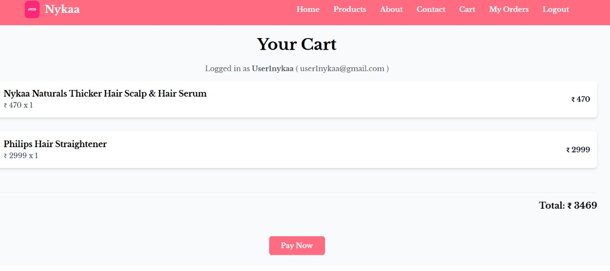

# WebsiteBoss – Website Creation Automation Tool 🛠️

WebsiteBoss is a full-stack web automation tool designed to help MSMEs (Micro, Small, and Medium Enterprises) rapidly launch professional websites tailored to their industry - such as cosmetics, pharmacy, and more. Built with scalability, flexibility, and automation in mind, WebsiteBoss reduces manual work and ensures consistent quality in website creation.

## 🚀 Features

- 🔧 **Industry-Specific Templates** – Predefined templates for common industries with customizable branding and content
- 🛒 **E-commerce Support** – Add-to-cart, checkout, and order tracking flows for all generated websites
- 💳 **Integrated Payments** – Secure UPI, card payments via **Razorpay**
- 🔐 **JWT-Based Authentication** – Secure login and role-based access control (RBAC) for admins and company users
- ☁️ **Cloud Deployment** – Hosted on **AWS EC2**, ensuring scalability and high availability
- 🖼️ **Dynamic Branding** – Easily update logos, colors, and content for each business without touching the code
- 📦 **Admin Dashboard** – Manage products, orders, and company information via a user-friendly dashboard

## 🏗️ Tech Stack

### 🧠 Frontend
- React.js
- TailwindCSS

### ⚙️ Backend
- Node.js
- Express.js
- JWT for authentication
- Razorpay for payments

### 🗄️ Database
- MongoDB

### 🌐 Hosting
- AWS EC2

## 📁 Folder Structure

```bash
SmartShelf/
├── backend/       # Node.js + Express server
├── frontend/      # React.js + Tailwind app
├── README.md
```

## 🛠️ Key Functionalities

- **Authentication:**
  - JWT-based login system
  - Role-based access (Admin vs Company User)

- **E-Commerce:**
  - Add-to-cart and order management
  - Dynamic product listings based on business data
  - Cart and My Orders page

- **Admin Controls:**
  - Add/Edit/Delete products
  - Update company branding and details

## 🌐 How It Works

1. Select an industry template (e.g.,Pharmacy, Cosmetics)
2. Fill out business details (name, logo, tagline, about, products, etc.)
3. Website is generated automatically with dynamic content
4. Customers can browse, order, and pay online
5. Admin and company users can manage content and orders from the dashboard

## 📦 Installation & Setup (For Local Development)

```bash
# Clone the repository
git clone https://github.com/aayush-mor13/Website-Boss
cd Website-Boss

# Install backend dependencies
cd backend
npm install

# Start backend server
npm run dev

# Install frontend dependencies
cd ../frontend
npm install

# Start frontend app
npm start
```

## 🔐 Environment Variables

Create a .env file in the backend directory with the following:

```bash
PORT=5000
MONGO_URL=your_mongodb_connection_string
JWT_SECRET_KEY=your_jwt_secret
```

Create a .env file in the frontend directory with the following:

```bash
REACT_APP_SERVER = your_backend_base_url
\REACT_APP_RAZORPAY_KEY = your_razorpay_api_key
```

## 📸 Screenshots

- Home Page


- Admin Dashboard


- Client Home Page


- Product Listing Page


- Cart and checkout



- Payment Screen


## 📤 Deployment

The application is deployed on AWS EC2 with Node.js and MongoDB configured in a production environment.

## 🧑‍💻 Author
Aayush Mor<br>
Frontend Developer | Backend Developer | Full-Stack Developer
- GitHub: [github.com/aayush-mor13](https://github.com/aayush-mor13)
- LinkedIn: [linkedin.com/in/aayushmor](https://www.linkedin.com/in/aayushmor)